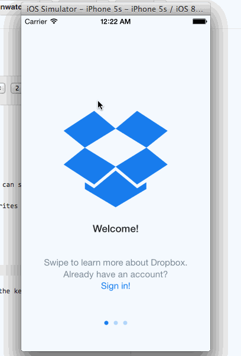

# dropboxVu
Homework 1

4 hours to complete homework

COMPLETED User can tap through the 3 welcome screens.
COMPLETED User can follow the create user flow.
COMPLETED On the create user form, the user can tap the back button to go to the page where they can sign in or create an account.
COMPLETED Before creating the account, user can choose to read the terms of service.
COMPLETED After creating the account, user can view the placeholders for Files, Photos, and Favorites as well as the Settings screen.
COMPLETED User can log out from the Settings screen.
COMPLETED User can follow the sign in flow.
COMPLETED User can tap the area for "Having trouble signing in?"
COMPLETED User can log out from the Settings screen.

None of the optional stories were completed at this time
Optional: Add a detail view for one of the files and implement favoriting the file.
Optional: Add UITextFields for the forms so you can actually type in them and handle dismissing the keyboard.
Optional: You should be able to swipe through the welcome screens instead of just tapping them.

